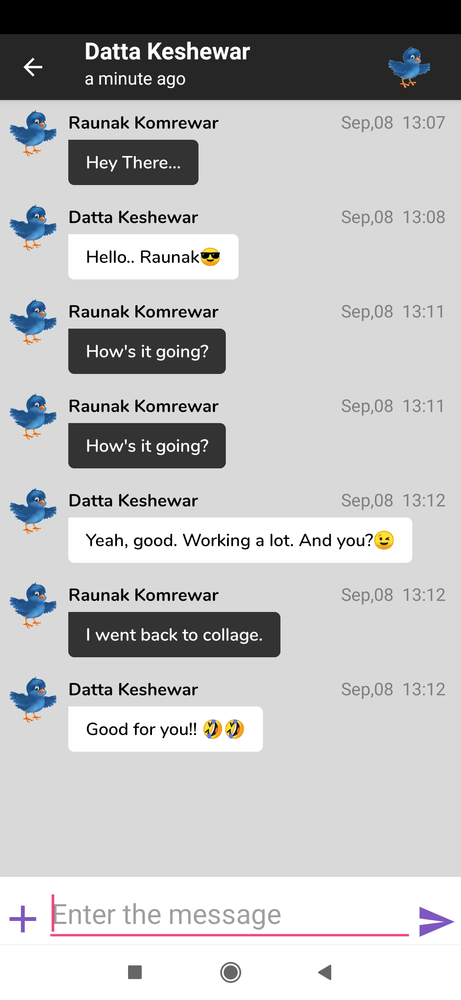

# <h1 align = "center">LETS CHAT APP</h1>
### <h3 align= "center">Simple firebase based Android app for chatting with friends</h1>
 &nbsp;  &nbsp;  &nbsp;  &nbsp; 
#
 &nbsp;  &nbsp;  &nbsp;  &nbsp; 
#
 &nbsp;  &nbsp;  &nbsp; 
# FEATURES

### &nbsp;  --->LOGIN , REGISTER
* Register new account
* Login with existing account
* Logout
* Firebase authentication for login and register

#### &nbsp; --->VIEW ALL USERS
* View all the users using the app
* View their profile image and status

#### &nbsp; --->MAKE NEW FRIENDS
* Search User
* Send friend request to any user
* Cancel friend request sent
* Accept friend request received
* Decline friend request received
* Notification will be received by receiver

#### &nbsp; --->MAINTAIN OWN ACCOUNT
* Change Profile Image
* Change Status

#### &nbsp; --->CHAT WITH FRIENDS
* Send Messages
* Send Images
* Delete Messages
* Last seen 
* Friend is Online or not

#### &nbsp; --->OTHERS
* Firebase Offline (Once page is loaded , one can view it in offline mode)
* Firebase Cloud Messaging , OKHTTP (for sending notification)
* Image Cropping 
* Image Compressing

### <h3 align="right">Anurag Komrewar &nbsp;&nbsp;&nbsp;&nbsp;&nbsp;&nbsp;&nbsp;&nbsp;</h5>
### <h5 align="right">Freelancer App designer & developer</h5>
